# 摘要：

本仓库主要介绍如何在Pytorch中使用聚类算法，这里介绍

- 简单常用K-means的简单实现
- 高效快速finch在pytorch中的应用

如果对你有帮助请点一下star⭐，😀Thanks

# 聚类算法分类

- 基于划分的聚类(**k‐均值算法**、k‐medoids算法、k‐prototype算法)
- 基于层次的聚类(**finch**)
- 基于密度的聚类(DBSCAN算法、OPTICS算法、DENCLUE算法)
- 基于网格的聚类
- 基于模型的聚类(模糊聚类、Kohonen神经网络聚类)

# 聚类算法评价

轮廓系数：**轮廓系数**是聚类算法用来判定聚类结果好坏的评估指标，完全依赖于簇内的稠密程度和簇间的离散程度来评估聚类的效果，即簇内差异小，簇外差异大。具体公式略

# K-means

## 1.算法流程

1. 生成初始k个聚类中心：随机初始k个点
2. 计算所有点到k中心点之间的距离
3. 将对应样本分到**距离最小**得到聚类中心所对应的**簇**(cluster)
4. 重新计算簇的质心作为新的聚类中心
5. 重复2~4，直到**聚类中心**或**簇中的点**不在发生变化，算法结束

## 2.修复的bug

**bug介绍：**

- 若点的数量较少，且聚类中心较多，
- 由于每一次都重新计算质心，
- 某些新计算的聚类的质心在下一轮的最近点的划分过程中没有一个点，这将导致无法进行下一轮的质心重新计算。

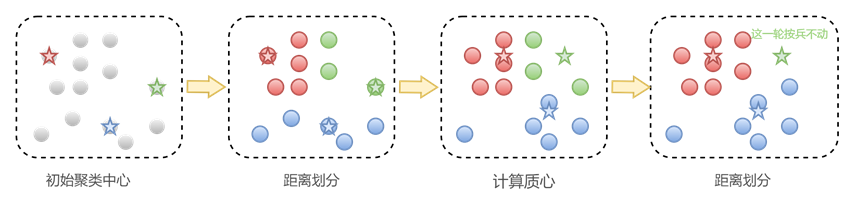

**解决：**若新的聚类中心中没有划分到任何一个点，则保持聚类中心不变，期待下一轮能够重新获得点。(若硬是要计算，没有点计算的聚类中心为Nan)


# finch

## 1.算法流程

### 1.1简介：

**finch：**使用第一邻居关系的**高效、无参数**聚类，属于分层聚合方法。

### 1.2 聚类公式

$$
A(i,j)=
\begin{cases} 
1 \quad if \quad j = k^1_i \quad or \quad  k^1_j = i\quad or \quad k^1_i=k^1_j\\
o \quad otherwise
\end{cases}
$$

**解释：**i点与j点是否近邻，取决于以下三个条件：

- i点的1近邻为j
- j点的1近邻为i
- i点的1近邻为q，且j点的1近邻为q

满足以上三个条件之一即可。

**论文中**，对【聚类公式】使用举了例子，可仔细揣摩一下

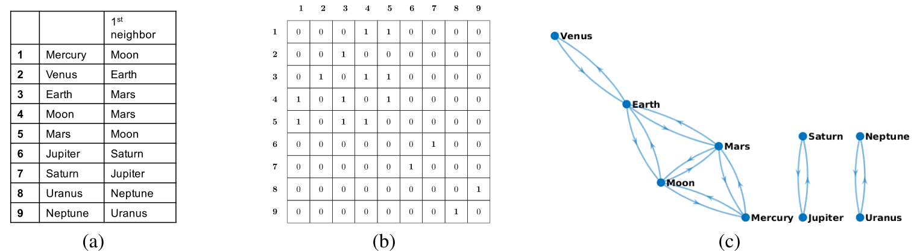

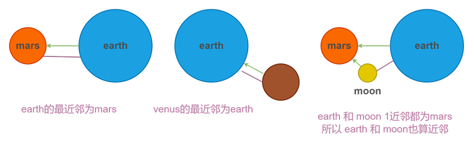

### 1.3 算法 

**（1）无指定k个簇：**

1. 计算每个点的初始 **1近邻**(knn算法一般设置为2，即自身和1近邻)；
2. 根据**公式1**计算**邻接矩阵**，要求邻接矩阵是严格对称（代码中通过将knn为2的邻接矩阵，通过矩阵×矩阵转置来实现上述公式1，很奇妙，不过得删除对角线元素）；
3. 计算连通域，获得联通数目(当前聚类数目)，和每个点的联通标签(点所在的簇)
4. 重新计算连通区域质心，作为下一轮待聚类的点
5. 重复1~4，实现将每一层的簇，一步一步合并，最终合并为1个簇

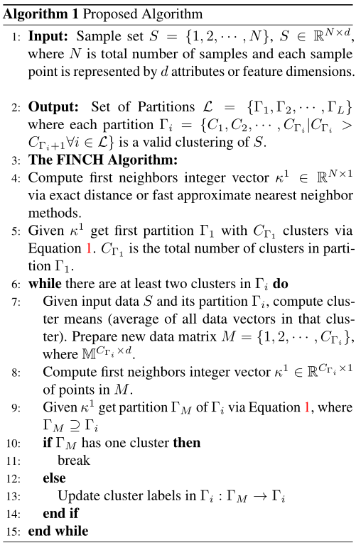

**（2）指定获得k个簇：**

**（2.1）论文中实现方法：**

**思想：**每次合并距离最近的2个簇，合并n-k次实现剩余k个簇。

1. 获得**（1）无指定k个簇** 的结果，找到簇数目**大于**k的第一个簇，簇数目记作n；

2. 计算每个点的初始 **1近邻**(knn算法一般设置为2，即自身和1近邻)；

3. 根据**公式1**计算**邻接矩阵**，要求邻接矩阵是严格对称（代码中通过将knn为2的邻接矩阵，通过矩阵×矩阵转置来实现上述公式1，很奇妙，不过得删除对角线元素）；

   👇

4. *将簇质心邻接矩阵距离最小的邻接设置为1，其余地方设置为0**(保证每次合并两个距离最近的簇)***；

5. 计算连通域，获得联通数目(当前聚类数目)，和每个点的联通标签(点所在的簇)；

6. 重新计算连通区域质心，作为下一轮待聚类的点；

7. 重复2~7 计算n-k次，实现将每一层的簇，一步一步合并，**最终合并为k个簇**。

   

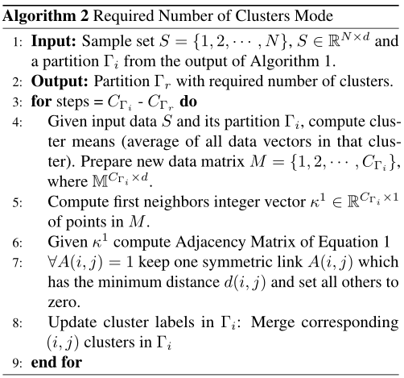

**（2.2）本文章中实现方法：**

**思想：**每次合并距离最近的n-k个簇（理想上，一般略小于n-k），重复几次实现该剩余k个簇。

1. 获得**（1）无指定k个簇** 的结果，找到簇数目**大于**k的第一个簇，簇数目记作n；

2. 计算簇质心的距离矩阵 [n,n]

3. 提取距离矩阵的**对角线以上部分**，提取该部分**距离最小的n-k个点**，将该部分点作为**邻接矩阵**（注意：非对称）

4. 计算连通域（**非对称的邻接矩阵使用无向图计算连通域**），获得联通数目(当前聚类数目)，和每个点的联通标签(点所在的簇)；

   ***注意：**理想上能够实现一次性将n-k个簇合并到距离最近的k个簇中，但是最近的n-k个边在计算连通域时可能有重复，**如：**1最近的点为5，5最近的点是1，这个近邻边就重复了，导致无法一次性合成n-k个点，所以需要循环多试几次，一定能成功！*

5. 重新计算连通区域质心，作为下一轮待聚类的点；

6. 循环多次2~4，最终合并为k个簇


## 2.修复的bug

**bug介绍：**

若第一轮 【\_finch( )】中生成簇的数目就小于k，则会执行【指定k个簇算法 \_req\_cluster( )】，但是第一轮们没有初始结果，于是会产生错误。

**解决：**在进行第一轮前初始化

```python
    def _init_result(self, X):
        """
        初始化result，防止当第一轮聚类时的联通区间数目小于k，导致result中无结果出现bug
        :param X:
        :return:
        """
        n_clusters_ = X.shape[0]
        labels_ = np.arange(n_clusters_)
        cluster_centers_ = X
        cluster_indices_ = np.arange(n_clusters_).reshape((n_clusters_, 1)).tolist()
        return {'parition_0': {
            'n_clusters': n_clusters_,
            'labels': labels_,
            'cluster_centers': cluster_centers_,
            'cluster_indices': cluster_indices_
        }}
```

## 4.实验

### 4.1 论文实验：

**（1）准确率**

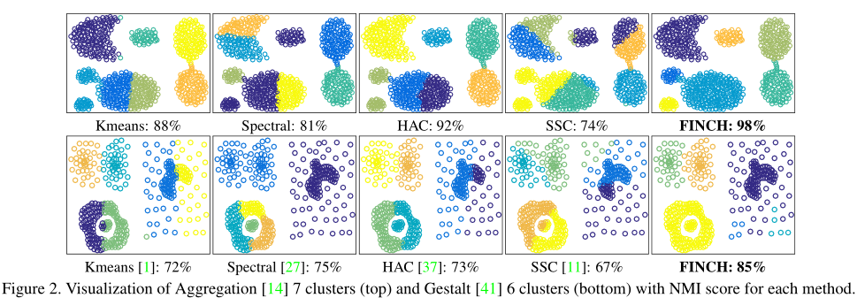

**（2）速度**

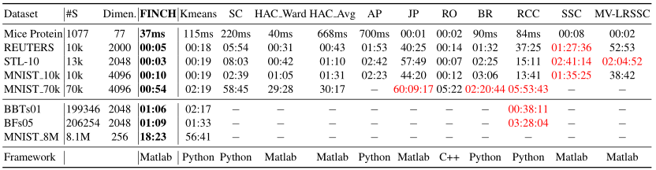

### 4.2 个人实验

本实验使用Github MIT代码，展示finch算法聚类获得的最佳簇，以及在不同数据量下的执行时间

**数据一**

| 实验次数 | 处理点 | 最佳簇数 | 轮廓系数 | 时间 (s) |
| -------- | ------ | -------- | -------- | -------- |
| 1        | 500    | 4        | 0.31     | 0.14     |
| 2        | 5000   | 3        | 0.42     | 0.20     |
| 3        | 50000  | 5        | 0.36     | 1.42     |

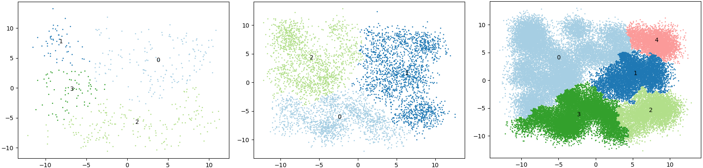

**数据二**

| 实验次数 | 处理点 | 最佳簇数 | 轮廓系数 | 时间 (s) |
| -------- | ------ | -------- | -------- | -------- |
| 1        | 500    | 4        | 0.42     | 0.07     |
| 2        | 5000   | 2        | 0.48     | 0.13     |
| 3        | 50000  | 13       | 0.33     | 1.41     |

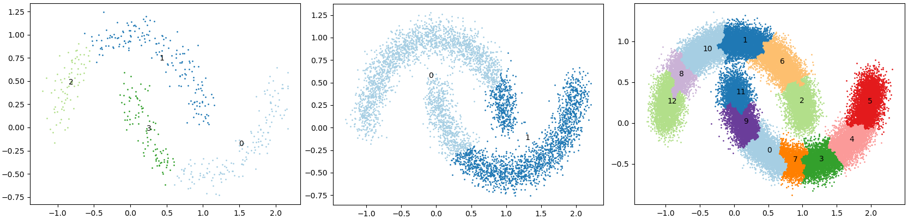

**数据三**

| 实验次数 | 处理点 | 最佳簇数 | 轮廓系数 | 时间 (s) |
| -------- | ------ | -------- | -------- | -------- |
| 1        | 500    | 50       | 0.39     | 0.06     |
| 2        | 5000   | 3        | 0.39     | 0.13     |
| 3        | 50000  | 6        | 0.37     | 1.30     |

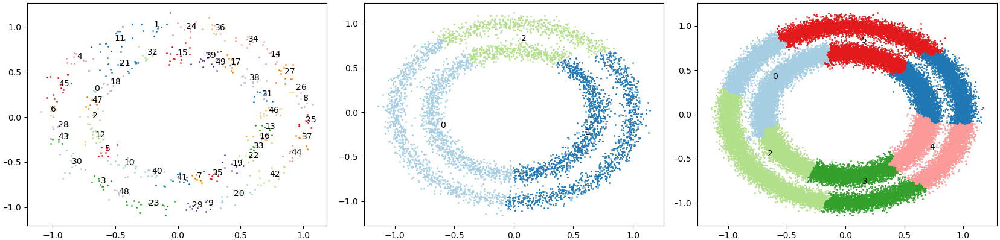


## 3.参考

[**论文：Efficient Parameter-free Clustering Using First Neighbor Relations**](https://arxiv.org/abs/1902.11266)

[博客1](https://www.zhihu.com/people/xian-tong-79)

[博客2](https://blog.csdn.net/qq_42183018/article/details/93618602)

# 实验对比

为了对比准确，我们这里使用指定k个聚类，即将finch改为指定聚类个数的算法

**实验总结：**


## 1.数据一

| 处理点 | 算法            | 时间 (s)  |
| ------ | --------------- | --------- |
| 500    | **kmeans(CPU)** | **0.044** |
|        | kmeans(GPU)     | 0.054     |
|        | finch(CPU)      | 0.047     |
| 5000   | kmeans(CPU)     | 0.893     |
|        | kmeans(GPU)     | 1.909     |
|        | **finch(CPU)**  | **0.121** |
| 50000  | kmeans(CPU)     | 7.457     |
|        | kmeans(GPU)     | 2.606     |
|        | **finch(CPU)**  | **2.181** |

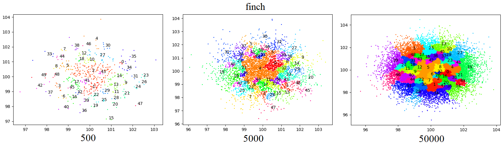

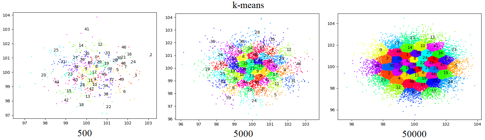

## 2.数据二

| 处理点 | 算法            | 时间 (s)  |
| ------ | --------------- | --------- |
| 500    | **kmeans(CPU)** | **0.037** |
|        | kmeans(GPU)     | 0.041     |
|        | finch(CPU)      | 0.040     |
| 5000   | kmeans(CPU)     | 0.430     |
|        | kmeans(GPU)     | 1.722     |
|        | **finch(CPU)**  | **0.104** |
| 50000  | kmeans(CPU)     | 7.609     |
|        | kmeans(GPU)     | 2.589     |
|        | **finch(CPU)**  | **2.053** |

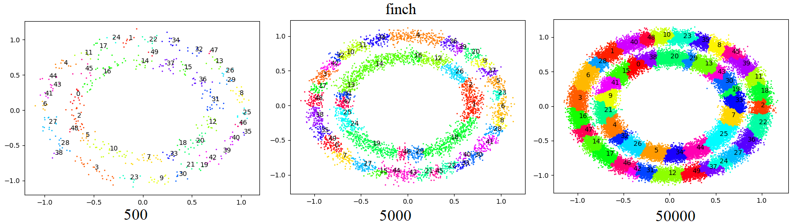

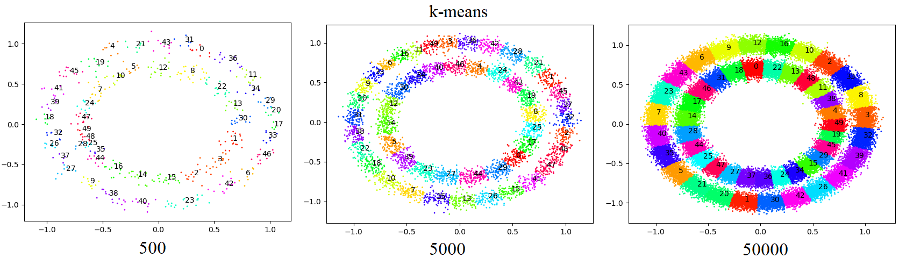

## 3.数据三

| 处理点 | 算法            | 时间 (s)  |
| ------ | --------------- | --------- |
| 500    | kmeans(CPU)     | 0.038     |
|        | **kmeans(GPU)** | **0.030** |
|        | finch(CPU)      | 0.051     |
| 5000   | kmeans(CPU)     | 0.404     |
|        | kmeans(GPU)     | 1.640     |
|        | **finch(CPU)**  | **0.120** |
| 50000  | kmeans(CPU)     | 7.729     |
|        | kmeans(GPU)     | 2.631     |
|        | **finch(CPU)**  | **2.101** |

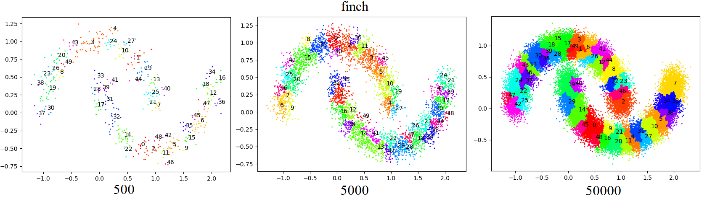

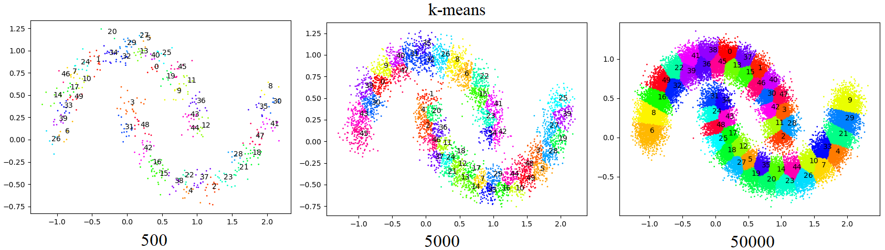